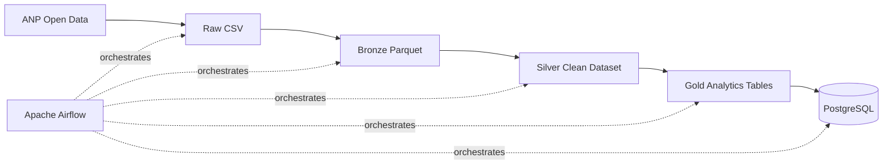

# Brazil Energy Data Platform

Production-style data engineering project that ingests, processes and serves
Brazilian energy and economic data.

## Business Problem

Energy analysts often need to combine data from multiple public sources with
different formats, schemas and update frequencies.

This project builds an automated data platform that ingests public Brazilian
energy and macroeconomic datasets and transforms them into reliable,
analytics-ready data products.

## Architecture

Sources → Raw Storage → Bronze → Silver → Gold → PostgreSQL → API / Analytics

## Engineering Goals

- Automated ingestion
- Incremental processing
- Idempotent pipelines
- Data quality validation
- Orchestration with Airflow
- Distributed transformations with Spark
- Reproducible local environment using Docker
- Automated testing and CI
- Analytics-ready dimensional models

## Tech Stack

Python | SQL | Apache Spark | Airflow | PostgreSQL | Docker | MinIO | FastAPI | GitHub Actions

## Architecture



### Data Flow

1. **Ingestion** — downloads official ANP petroleum production data.
2. **Raw** — preserves the original source file unchanged.
3. **Bronze** — converts the source into typed Parquet data.
4. **Silver** — normalizes dates, text fields, duplicates and invalid records.
5. **Gold** — creates analytics-ready aggregates and year-over-year metrics.
6. **PostgreSQL** — exposes curated datasets through an analytical database.
7. **Airflow** — orchestrates the full end-to-end pipeline.

## Engineering Features

* Automated ingestion from public data sources
* Raw / Bronze / Silver / Gold architecture
* Parquet columnar storage
* Data-quality validation
* Idempotent PostgreSQL upserts
* Dockerized infrastructure
* Apache Airflow orchestration
* Automated testing with pytest
* Continuous Integration with GitHub Actions
* Reproducible local environment

## Tech Stack

**Languages:** Python, SQL

**Data:** Pandas, PyArrow, Parquet

**Orchestration:** Apache Airflow

**Database:** PostgreSQL

**Infrastructure:** Docker, Docker Compose

**Quality:** pytest, GitHub Actions

## Running Locally

```bash
git clone https://github.com/PetrulliAlex/brazil-energy-data-platform.git
cd brazil-energy-data-platform

cp .env.example .env

docker compose up -d

python -m src.ingestion.anp_oil_production
python -m src.transformations.anp_oil_bronze
python -m src.transformations.anp_oil_silver
python -m src.transformations.anp_oil_gold
python -m src.loaders.postgres_loader
```

Alternatively, trigger the complete pipeline through Apache Airflow.

## Data Source

Brazilian National Agency of Petroleum, Natural Gas and Biofuels — ANP Open Data.

## Project Goal

This project demonstrates the design of a production-style data platform rather than a standalone analytical notebook.

The emphasis is on reliability, reproducibility, data quality, orchestration and maintainable data transformations.
